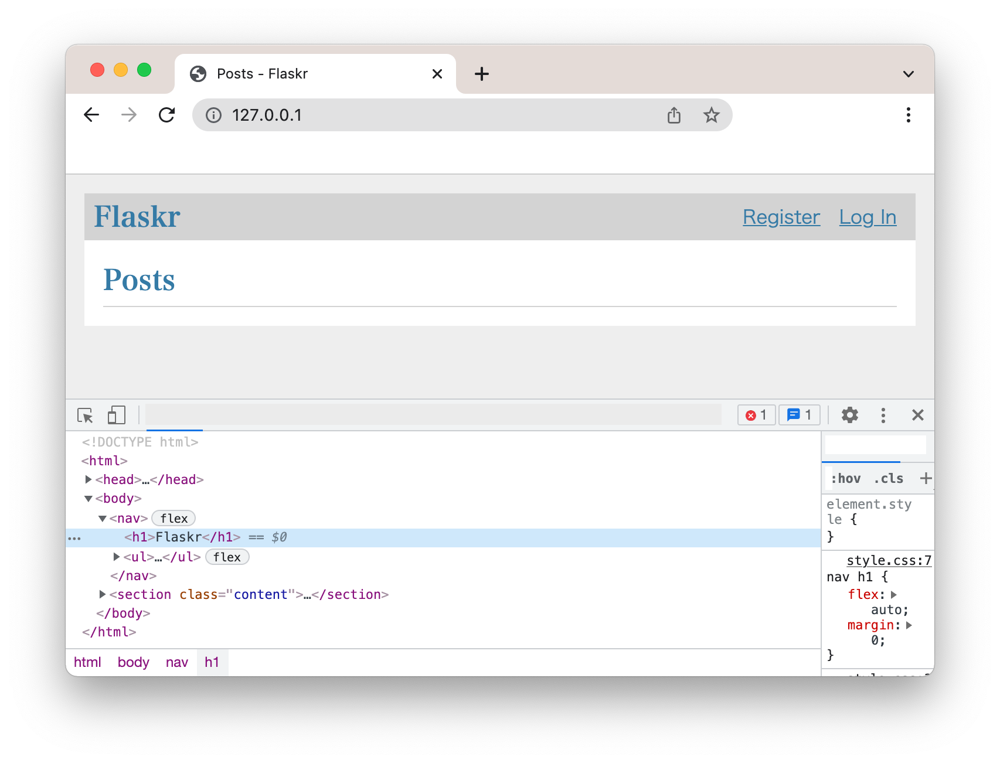

= Selenium Test in Java backed by Docker Container

@author kazurayam
@date 4 Feb, 2022

== Problem to solve

I am interested in automated tests for Web UI using Selenium WebDriver in Java/Groovy. Also I am interested in developing Web Server applications in Python. So I want to execute UI tests written in Java against my Web Application written in Python. I can do it by the following manual operations. 

(1) in a Terminal window on Mac, I will start a Docker container to launch a HTTP server by

----
$ cd ~/tmp
$ docker run -d -p 80:8080 kazurayam/flaskr-kazurayam:1.1.0
----

(2) I will open another Terminal window, and execute UI tests by:

----
$ cd $projectDir
$ gradle test
....
----

(3) when the test has finished, I will go back to the first terminal window. I will identify the id of the running docker container.

----
$ docker ps --filter publish=80 --filter status=running -q
fd5ad3b76b13
----

(4) I will stop the container gracefully by:

----
$ docker stop fd5ad3b76b13
----

This procedure is not difficult. But it is cumbersome. I often forget terminating the previous docker container. When I try to start a container again, I get an error saying "the IP port is already in use", which makes me irritated.

I want to automate starting and stopping any Docker Container on the localhost by JUnit tests.

== Solution

I have developed a JUnit test which does the following:

* The test visits a URL "http://127.0.0.1:3080/" using Selenium WebDriver.

* The URL is served by a process on the localhost, in which a Docker Container runs using a docker image that I prepared.

* The web app was developed in Python language by the Pallets project, is published at link:https://flask.palletsprojects.com/en/2.0.x/tutorial/[]

* This test automates running and stopping a Docker Container using the well-known commandline commands: `docker run`, `docker ps` and `docker stop`.

* The https://github.com/kazurayam/subprocessj/blob/master/src/main/java/com/kazurayam/subprocessj/docker/ContainerRunner.java[`com.kazurayam.subprocessj.docker.ContainerRunner`] class wraps the "docker run" command.

* The https://github.com/kazurayam/subprocessj/blob/master/src/main/java/com/kazurayam/subprocessj/docker/ContainerFinder.java[`com.kazurayam.subprocessj.docker.ContainerFinder`] class wraps the "docker ps" command.

* The https://github.com/kazurayam/subprocessj/blob/master/src/main/java/com/kazurayam/subprocessj/docker/ContainerStopper.java[`com.kazurayam.subprocessj.docker.ContainerStopper`] class wraps the "docker stop" command.

* These classes internally call https://www.baeldung.com/java-lang-processbuilder-api[`java.lang.ProcessBuilder`] to execute the `docker` command from Java.

* The `ProcessBuilder` is wrapped by the https://github.com/kazurayam/subprocessj/blob/master/src/main/java/com/kazurayam/subprocessj/Subprocess.java[`com.kazurayam.subprocessj.Subprocess`] class which provides a simplified API to run arbitrary OS commands.

== Description

=== Environment

* I installed https://www.docker.com/products/docker-desktop[Docker Desktop] on my Mac. Docker Descktop for Windows is also available.

* Java8+ is required. Gradle v6+ is required

* I tested this on Mac with bash. It should run on Windows as well.

=== Sequence diagram

The following diagram shows how the sample code works.

image::https://kazurayam.github.io/SeleniumTestInJavaBackedByDockerContainer/diagrams/out/sequence.png[sequence]

=== Sample code

For full code, see the follow the link.

* link:https://github.com/kazurayam/SeleniumTestInJavaBackedByDockerContainer/blob/master/src/test/java/example/DockerBackedWebDriverTest.java[example.DockerBackedSeleniumTest]

I will quote from the source some fragments that would be of your interest.

==== @BeforeAll

starting a Docker container

[soure,java]
----
include::src/test/java/example/DockerBackedSeleniumTest.java[lines=66..76]
----

==== @BeforeEach

opening a web browser

[soure,java]
----
include::src/test/java/example/DockerBackedSeleniumTest.java[lines=81..84]
----

==== @Test

navigate to a URL, verify the HTML

[soure,java]
----
include::src/test/java/example/DockerBackedSeleniumTest.java[lines=90..97]
----

The page looks like this:

==== @AfterEach

closing the browser

[soure,java]
----
include::src/test/java/example/DockerBackedSeleniumTest.java[lines=102..108]
----

==== @AfterAll

stopping the Docker container

[soure,java]
----
include::src/test/java/example/DockerBackedSeleniumTest.java[lines=116..128]
----

== How to reuse this

See the https://github.com/kazurayam/SeleniumTestInJavaBackedByDockerContainer/blob/master/build.gradle[build.gradle]

[soure,java]
----
include::build.gradle[build.gradle]
----

== Conclusion

The https://mvnrepository.com/artifact/com.kazurayam/subprocessj[Subprocessj 0.3.0] library enabled me to perform automated Web UI testings written in Java/Groovy against a web application written in Python in Docker Container. I could use Java and other programming languages mixed and integrated to build my applications.

== References for Docker

* https://forums.docker.com/t/docker-run-cannot-be-killed-with-ctrl-c/13108[forum.docker.com, “docker run” cannot be killed with ctrl+c]
* https://matsuand.github.io/docs.docker.jp.onthefly/engine/reference/commandline/ps/[docker ps command]
* https://docs.docker.com/engine/reference/commandline/run/[docker run command]
* https://matsuand.github.io/docs.docker.jp.onthefly/engine/reference/commandline/stop/[docker stop command]

== links

The Subprocessj project's artifact is available at the Maven Central repository:

* link:https://mvnrepository.com/artifact/com.kazurayam/subprocessj[https://mvnrepository.com/artifact/com.kazurayam/subprocessj]

The project's repository is here

* https://github.com/kazurayam/subprocessj/[the repository]
